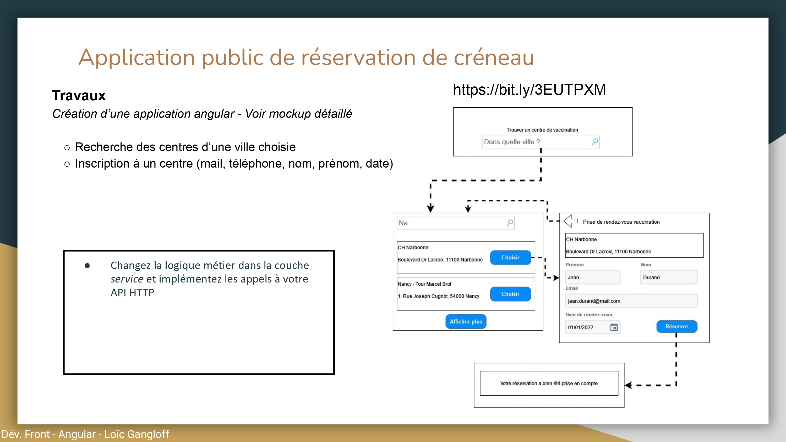
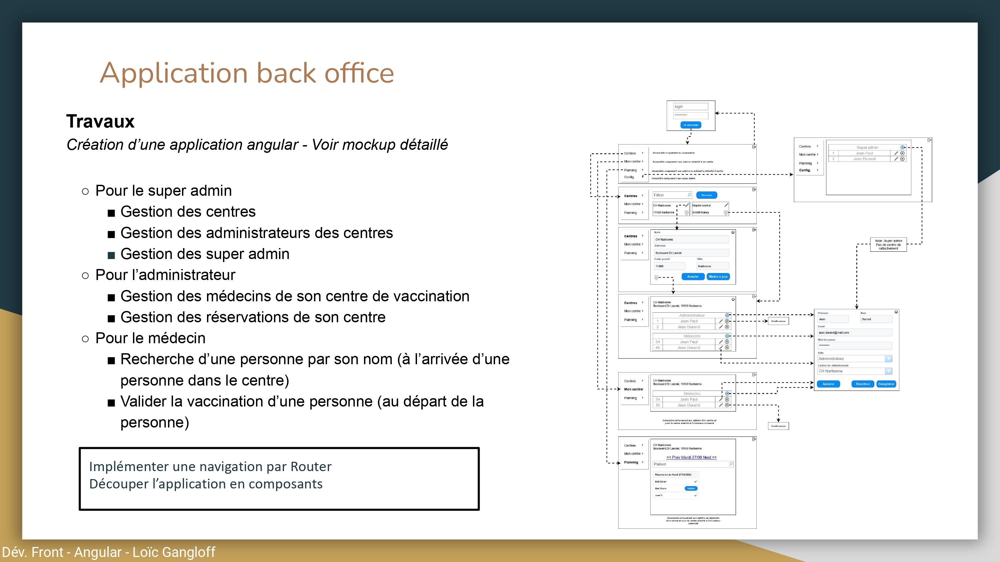

# Gaplaut2 

Gaplaut2 is a web application for managing a fleet of medical centers. 
Here you can find its frontend developed with the Angular framework.

## Installation

### Requirements

- Git
- Node.js
- npm


### Run the application

1. Clone the repository
```bash
git clone https://github.com/Mnl-GRTN/Gaplaut2-Front.git
cd Gaplaut2-Front
```

2. Install the dependencies
```bash
npm install
```

3. Run the application
```bash
ng serve
```

4. The application should be running on `http://localhost:4200/`


## Use of the application

### Public application for booking vaccination appointments
- As a patient, you can book an appointment in a medical center.

### Back office application for managing the fleet of medical centers
- As an superadmin, you can manage the medical centers and the people working in them.
- As an admin, you can manage the appointments of the medical center you are in charge of and the doctors working in it.
- As a doctor, you can manage your appointments.

## Test the application
- You can use the following credentials to test the application:
  - superadmin: 
    - email:superadmin
    - password:superadmin
  - admin:
    - centre:2
       - email:admin
       - password:admin
    - centre:3
       - email:admin2
       - password:admin2
  - doctor:
    - centre:2
       - email:doctor
       - password:doctor
    - centre:3
       - email:doctor2
       - password:doctor2


## Instructions of the assignment

### Public application for booking appointments
</img>

### Back office application for managing the fleet of medical centers
</img>
